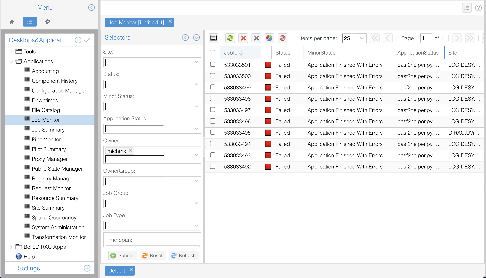

# Submitting jobs to the grid

You should have a steering script from the basf2 tutorial. Let's practice how to submit jobs to the 
grid and monitor them.

## A simple job submission

```{warning}
Remember the first rule of gbasf2: test your script before submitting!
```

A **project** in gbasf2 is defined by a steering script and a set of input files.

To submit a project to the grid, you need 

* A name
* A steering file 
* A Basf2 release version
* An input dataset

Let's submit a first project using as input the files located in the Logical Path (LPN)

`/belle/group/physics/Charmonium/belle_starterkit/BptoKpX3872_MC16ri` 

First let's look at what this LPN contains

```bash 
gb2_ds_list /belle/group/physics/Charmonium/belle_starterkit/BptoKpX3872_MC16ri
```

You may immediately notice a `sub00`. This in the Belle II grid jargon is a **datablock**, a set of files grouped 
together for easier data management. Datasets can contain one or more datablocks, but this should be transparent to 
users (you don't need to explicitly add them).

Look inside the datablock. 
```bash
gb2_ds_list /belle/group/physics/Charmonium/belle_starterkit/BptoKpX3872_MC16ri/sub00
```
How many files did you find?

Now we are ready to submit your first project. Use the command 

```bash
gbasf2 steering_file_complete.py \
       -p myfirstProject \
       -s light-2511-gacrux \
       -i /belle/group/physics/Charmonium/belle_starterkit/BptoKpX3872_MC16ri
```

Look at the information provided by gbasf2. Does everything look fine?

If yes, confirm the submission typing `y`.

````{note}
You may have noticed the message "Please consider providing --cputime or --evtpersec". 
This is optional but strongly recommended information that helps the grid scheduler to better allocate resources.

Check how to calculate the events per second at [setting-the-cpu-time](https://gbasf2.belle2.org/runningJobs.html#setting-the-cpu-time). In short

```bash
evtpersec = nevents / (20 * <total time on KEKCC in seconds>)
```

Where 20 is a normalization factor for KEKCC computing power (given by a standard CPU benchmark).

Currently, for analysis jobs the default value is 100 events per second. Check if your steering file deviates significantly from this value 
and provide a more accurate estimate.
````

```{note}
Project names should be unique. Gbasf2 works with a relation 1-to-1 between projects and input datasets.
 
If you try to submit a project with a name that already exists, the submission will be rejected.
```

## Monitoring your jobs

Once the jobs are submitted, you can monitor their status with the command

```bash
gb2_project_summary -p myfirstProject
```

Ahd their status with

```bash
gb2_job_status -p myfirstProject
```

All good? 

You can also monitor your jobs via the DIRAC web portal at https://dirac.cc.kek.jp:8443/DIRAC/. Go to the
JobMonitor and check the status. 




What happened?

## Debugging errors

As a rule of thumb 

* If **some** of your jobs failed, there is a good chance the problem is an specific site.
* If **all** your jobs failed, the problem is likely in your steering file or in the input dataset.

If the first, contact the comp-users-forum with details of the issue: job IDs, error messages, etc.

To debug the second case, you can check the log files of your jobs. Use the command
```bash
gb2_job_output -j <jobID> 
```
to download the output of a specific job. Then check the `Script1_basf2helper.py.log` file.

Can you identify what is the problem?

## Attaching files to the sandbox 

The jobs are executed in a clean environment. If your steering file depends on other files (e.g. libraries, NN weights, etc), 
you need to attach them to the _sandbox_.

You can do this with the `-f` option of `gbasf2`. In this exercise, our steering file depends on `variable_aliases.py`.

Let's resubmit the project attaching this file to the sandbox.

```bash
gbasf2 steering_file_complete.py \
       -p myfirstProject_v2 \
       -s light-2511-gacrux \
       -f variable_aliases.py \
       -i /belle/group/physics/Charmonium/belle_starterkit/BptoKpX3872_MC16ri
```

Can you confirm the file is attached to the sandbox?

```{note}
Currently, files in the input sandbox should not exceed 10 MB. If you need larger files, consider using the option `--lfn_sandboxfiles` 
together with `-f`. See details at 
the [gbasf2 manual](https://gbasf2.belle2.org/runningJobs.html#adding-files-in-the-input-sandbox).

This will become the default behavior in future versions of gbasf2.
```

Can you monitor and confirm all is good with this new submission?


