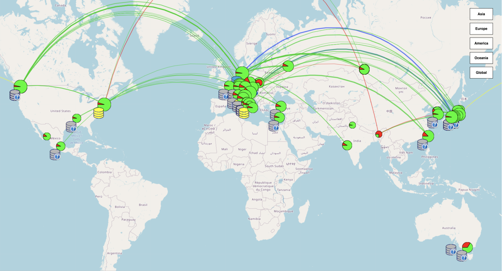

# Introduction to GBasf2 

This is a quick introduction to GBasf2, the software framework used in the Belle II experiment 
for analysis on the grid.

This tutorial is a condensed version of the GBasf2 introduction from the [Belle II Online Book](https://software.belle2.org/development/sphinx/online_book/index-01-online_book.html), 
presented in the [HSF-India Scientific Computing Workshop](https://indico.cern.ch/event/1580090) - IIT Madras.

```{tableofcontents}
```

